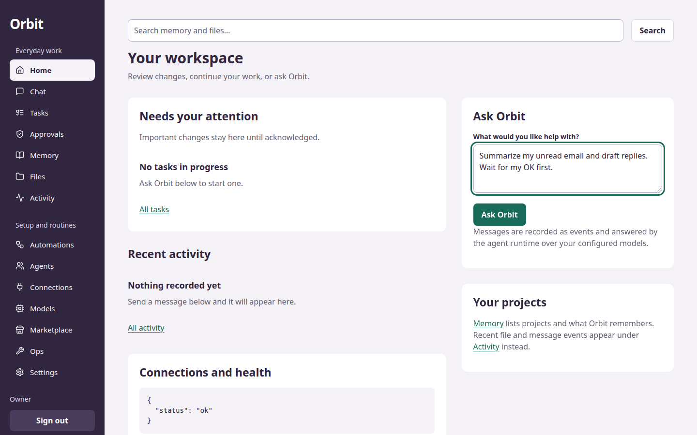
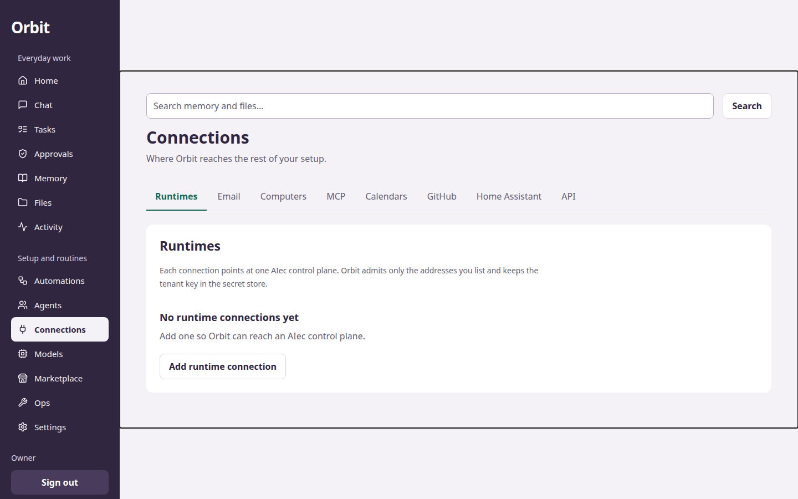
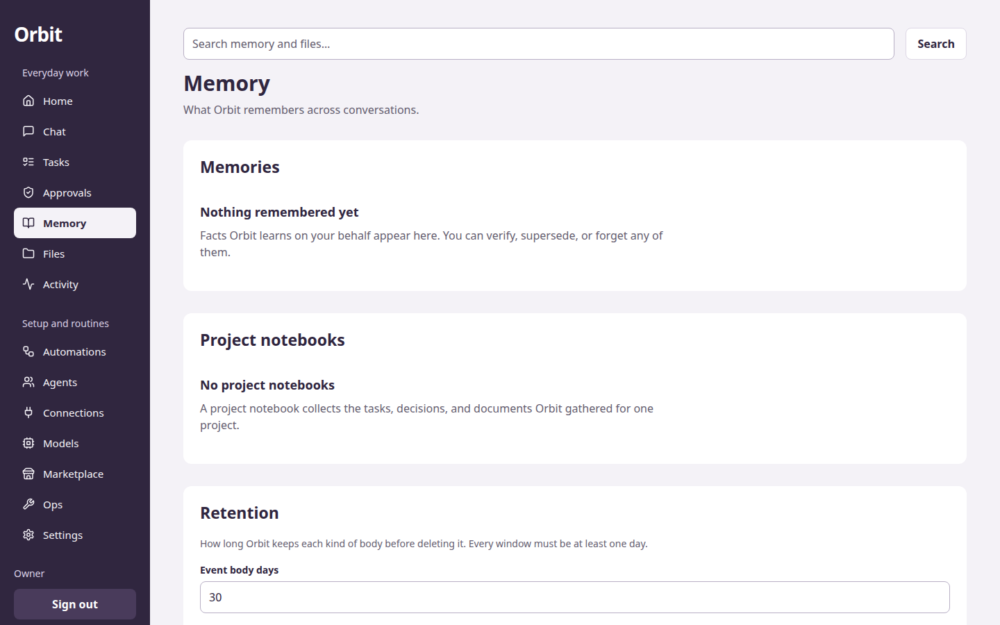

# Orbit

Orbit is a personal AI platform for one owner. One web workspace, one server,
one database. The owner pairs a computer node, connects models, and runs
assisted tasks with a durable record for every action.

- Product: `PRODUCT.md` (status truth source: `docs/PARITY.md`)
- Design system: `DESIGN.md`
- Docs: table below
- Deploy: `compose.yaml` (production), `deploy/examples/` (TLS, test, GPU, acceptance)
- Web workspace: `apps/web/` (React 19, Vite 7, Router 7, TanStack Query 5)
- Server: `apps/server/` (`orbit-server`, serves with no subcommand; `bootstrap-token` prints the setup token)
- E2E: `tests/e2e/` (Playwright, serial, isolated `orbit-test` deployment)

## What it looks like

Real screenshots from a running Orbit (captured on the isolated e2e
deployment, clean database — these are the actual app):



Home. You type what you need and it becomes a job you can follow — cancel it
or run it again. Nothing just vanishes into a chat window.



Connections. Email, calendars, files, your other computers — you add each one
yourself. Nothing is connected until you connect it.



Memory. Notes and project facts you can look at, fix, or delete — plus a
setting for how long anything sticks around.

## Quick start

Pinned tagged releases only — scripts refuse unpinned runs (no `latest`, no branches):

```sh
./install.sh --version vX.Y.Z
```

What it does, in order (`docs/INSTALL.md`): detects OS/arch and Docker/Ollama;
fetches `orbit-<version>-<os>-<arch>.tar.gz` plus checksum and signature;
verifies both fail-closed; generates `.env` (`0600`, passwords never echoed);
runs `docker compose up -d --build`; pulls the embedding model (`ollama pull`,
offline-safe with notice); waits for `/ready`, then prints the URL + bootstrap
step. Flags: `--dry-run` (plan only), `--yes`, `--upgrade`, `--uninstall`.
ARM64 included: `install.sh` maps `aarch64→arm64` (`install.sh:49-50`) —
Raspberry Pi 5 (8GB, USB SSD, 64-bit OS) is a documented reference tier
(`docs/PARITY.md`).

Computer node (Linux/macOS):

```sh
./install-node.sh --version vX.Y.Z --server https://orbit.example --pair <code>
```

Verified HTTPS only; Windows via `install-node.ps1`. Details + signed dry-run
transcripts: `docs/INSTALL.md`.

Web: `http://127.0.0.1:8080` · API: `http://127.0.0.1:3000` (via web proxy at
`/api/*`, `/health`, `/ready`).

## Docs

| Doc | Covers |
|---|---|
| `docs/PARITY.md` | Ghost Core parity matrix — the status truth source |
| `docs/INSTALL.md` | Pinned installer, node installers, verification transcripts |
| `docs/OPS.md` | Kill switch, automation dry-run, encrypted backup/restore, doctor, search |
| `docs/OTA.md` | Signed `stable` channel, owner-approved node self-update + `.bak` rollback |
| `docs/AIEC.md` | Disposable execution on operator-provisioned AIec |
| `docs/NODES.md` | Per-platform computer-node state |
| `docs/CONNECTORS.md` | Ingestion boundary + connector status |
| `docs/CLASSIFIER.md` | Risk classifier interface (advisory-only) |
| `docs/MCP.md` | MCP servers: register → discover → grant → call |
| `docs/web.md` | Web workspace contract + surfaces |
| `docs/deploy.md` | Production / TLS / GPU / test deployments |
| `docs/changelog.md` | Workstream changelog |

Status key (from `docs/PARITY.md`): **LIVE-PROVEN** = exercised by a test/e2e
path in-repo. **BUILT** = code exists, no live proof. **PARTIAL** = works with
named gaps. **UNAVAILABLE** = names the exact missing prerequisite.

## Milestone truth

Milestones 1–10 are live in the API router (`crates/api/src/lib.rs::router()`
merges auth, foundation, models, gateway, memory, automations, runtimes,
email, mcp, marketplace, computers, agents, push, ops, updates, brief) and
wired in the web workspace: setup/login, settings, events, tasks with
recovery, activity, notifications, live stream, provider/model catalog (M2),
agent runtime and chat (M3), approvals (M4), computers and files with pairing
(M6), memory and retention (M7), automations (M8), email (M9), MCP (M10).
Golden journeys J1–J10 run live in `tests/e2e/golden.ts`. No mock routes, no
fake success.

LIVE-PROVEN (each names its test path): marketplace signed installs
(`crates/api/tests/marketplace.rs` — tamper/unsigned/capability); encrypted
backup/restore (`crates/api/tests/ops.rs::encrypted_backup_round_trips_one_row`);
ops kill switch + automation dry-run (`crates/api/tests/ops.rs`, 3 tests) +
doctor script (`scripts/doctor.sh`, PASS/FAIL/SKIP); morning brief
(`crates/api/tests/brief.rs` + `BriefPanel` in `apps/web/src/workspace.tsx`);
OTA signed `stable` channel (`crates/api/tests/updates.rs`, 6 tests) + node
stage/rollback (`apps/computer-node/src/update.rs` tests, 3 tests); PWA push
(`tests/e2e/golden.ts` J8; RFC 8291 vectors in `crates/api/src/push.rs`
tests); IMAP/SMTP ingest (`crates/api/tests/email_greenmail.rs` vs GreenMail
fixture).

PARTIAL: Firecracker worker — no schedulable worker on this machine (Docker
worker proven live; `docs/AIEC.md`); semantic search — embedder installs via
the installer, query path stays lexical (`POST /memory/search`).

UNAVAILABLE (each names its missing prerequisite): Gmail/Graph OAuth
connectors (owner OAuth client credentials); CalDAV poller (no poller in
`crates/email/src/`); Android node app (Kotlin app + emulator-tested APK);
iPhone companion app (Xcode + Apple Developer account — PWA is the fast
path); release-signing pipeline + rollback path beyond the node `.bak`;
per-source/per-agent budgets; automation templates; notification routing
rules. Full roadmap: `docs/PARITY.md`.
